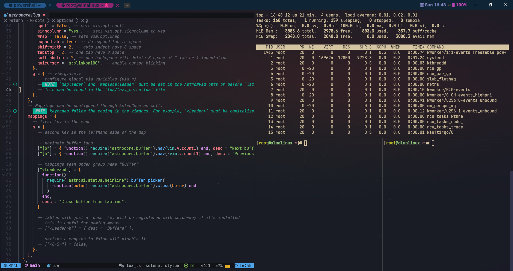
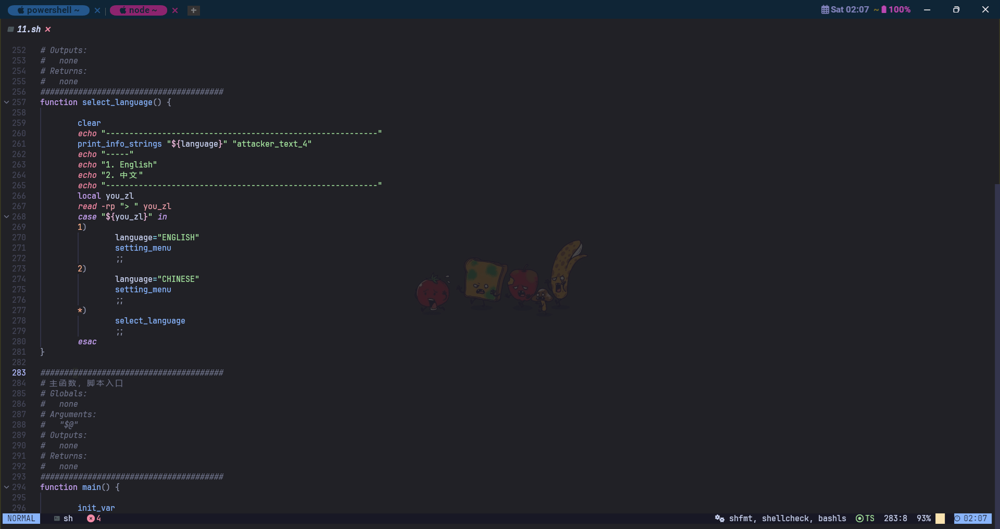
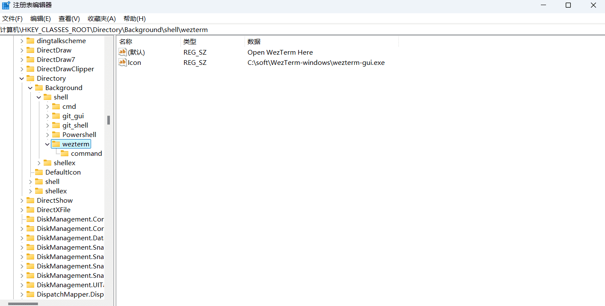
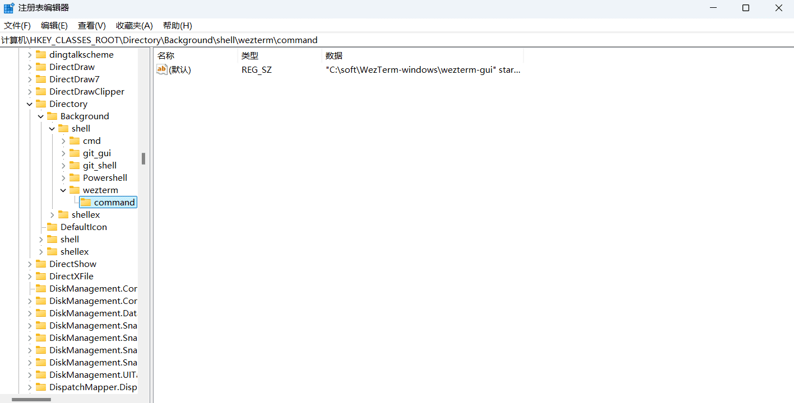

<div align="center" id="madewithlua">
  
</div>

<h1 align="center">WezTerm</h1>

<div align="center">
  <a href="https://github.com/QianSong1/wezterm-config/releases"></a>
  <a href="https://github.com/QianSong1/wezterm-config/stargazers"></a>
  <a href="https://github.com/QianSong1/wezterm-config/issues"></a>
  <br />
  <a href="https://github.com/QianSong1/wezterm-config/blob/main/LICENSE"></a>
  <a href="https://github.com/QianSong1/wezterm-config"></a>
</div>

<p align="center" style="font-weight: bold;">
A GPU-accelerated cross-platform terminal emulator and multiplexer written by <a href="https://github.com/wez">@wez</a> and implemented in <a href="https://www.rust-lang.org">Rust</a>
</p>
<p align="center">
User facing docs and guide at: <a style="font-weight: bold;" href="https://wezterm.org">wezterm.org</a>
</p>


# 我的WezTerm配置

**截图一**

 

**截图二**

 


## 相关链接

- <https://github.com/rxi/lume>
- <https://github.com/catppuccin/wezterm>
- <https://github.com/wezterm/wezterm/discussions/628#discussioncomment-1874614>
- <https://github.com/wezterm/wezterm/discussions/628#discussioncomment-5942139>
- <https://github.com/wezterm/wezterm/discussions/628#discussioncomment-3649195>


## 原作者仓库

- <https://github.com/KevinSilvester/wezterm-config>


## 前提条件

**1、安装`wezterm`终端**

[WezTerm终端](https://github.com/wezterm/wezterm/releases)

安装目录：C:\soft\WezTerm-windows

**2、安装`nerdfont`字体**

[MesloLGM Nerd Font](https://github.com/ryanoasis/nerd-fonts/blob/v3.2.1/patched-fonts/Meslo/M/Regular/MesloLGMNerdFont-Regular.ttf)

[JetBrainsMono NF](https://github.com/ryanoasis/nerd-fonts/blob/v3.2.1/patched-fonts/JetBrainsMono/Ligatures/Regular/JetBrainsMonoNerdFont-Regular.ttf)

字体版本 `v3.2.1` ，注意了，版本很重要，如果某些图标弃用了或更新了，那么就需要更新字体版本，或者更新图标，**总而言之：必须让字体版本与图标对应上，否则就会出现奇怪的乱码**

[图标 icon 搜索网站](https://www.nerdfonts.com/cheat-sheet)


## 使用方法

1、下载本储存库压缩包

2、解压压缩包

3、将解压的文件放入：`$HOME/.config/wezterm`目录底下

Windows目录：`C:\Users\Fizz\.config\wezterm`


## 快捷键

```bash
#快捷键
Ctrl+shift+c    --复制
Ctrl+shift+v    --粘贴
Ctrl+shift+r    --重命名标签栏
Ctrl+alt+[\]    --水平拆分窗格，即左右拆分
Ctrl+alt+[/]    --垂直拆分窗格，即上下拆分
Ctrl+alt+[-]    --关闭当前窗格
Ctrl+alt+z      --最大化/最小化当前窗格
F11             --全屏
Ctrl+alt+[↑]    --向上扩展窗格
Ctrl+alt+[↓]    --向下扩展窗格
Ctrl+alt+[←]    --向左扩展窗格
Ctrl+alt+[→]    --向右扩展窗格
Alt+[↑]         --放大字体
Alt+[↓]         --缩小字体
Alt+r           --重置字体大小
```


## 配置右键菜单

win+r 输入 regedit 打开注册表编辑器，依次展开`HKEY_CLASSES_ROOT`

- 底下的 `HKEY_CLASSES_ROOT\Directory` 
- 底下的 `HKEY_CLASSES_ROOT\Directory\Background` 
- 底下的  `HKEY_CLASSES_ROOT\Directory\Background\shell` 
- 新建一个项 `wezterm` ，在 `wezterm` 编辑 `Icon` 数据指向wezterm安装程序图标，编辑 `（默认）` 数据为菜单名称如 `Open Wezterm Here`，

  

然后右键新建一个项`command`，编辑 `（默认）` 数据：`"C:\soft\WezTerm-windows\wezterm-gui" start --no-auto-connect --cwd "%V\\"`

  


**完成~~~ 享受**🎉🎉🎉

